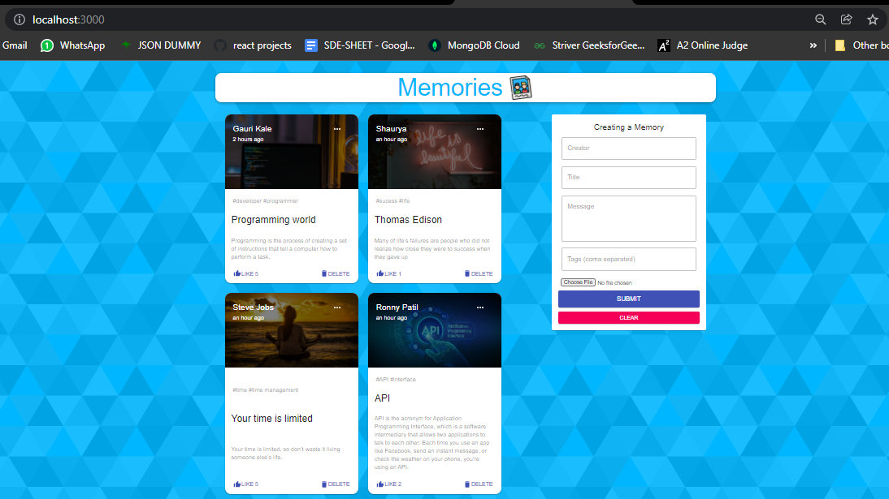

# Memories

<!--  -->



Front end - React,javascript,html,css
Back end- NODE JS


**Application Link** :      https://memories-gaurikale.netlify.app


Application -  This is memory application and it is a simple social media app that allows users to post interesting events that happened in their lives.We can perform various CRUD operation like create post,update post,delete and read post also there is like feature.

Setup:
- run ```npm i && npm start``` for both client and server side to start the app
